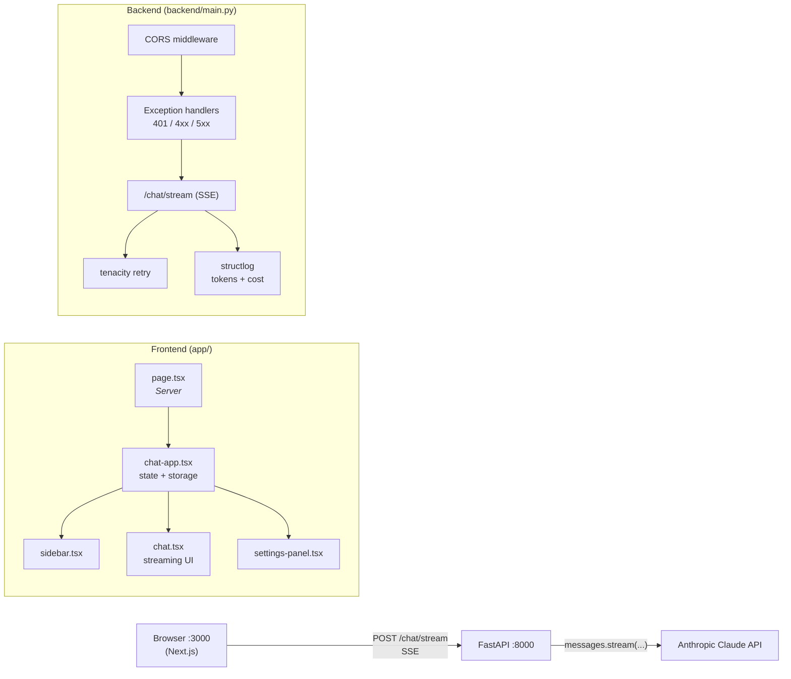

# AI Chat App

A minimal multi-conversation chat client for the Anthropic API. FastAPI backend, Next.js frontend, streaming via Server-Sent Events.

## Features

- Streaming chat with Claude (Opus 4.7, Sonnet 4.6, Haiku 4.5)
- Multiple conversations, persisted to `localStorage`
- Editable system prompt + model picker
- Stop generation mid-stream (`AbortController`)
- Per-conversation cost tracking from real token counts
- Retry on Anthropic overload / 5xx / connection errors (tenacity)
- Clean JSON error responses, no broken streams on upstream failures
- Structured JSON request logs via structlog

## Architecture



**SSE protocol on this app's wire**

Each event carries a JSON object with a `type` discriminator — the same pattern Anthropic and OpenAI use. `[DONE]` is the only non-JSON sentinel, kept as a literal terminator.

```
data: {"type":"content","text":"Hello"}
data: {"type":"content","text":", how can I help?"}
data: {"type":"usage","input_tokens":42,"output_tokens":87,"cost_usd":0.000234}
data: {"type":"error","message":"Overloaded"}     ← only on mid-stream failure
data: [DONE]                                       ← terminator (always)
```

JSON encoding escapes newlines automatically, so model output with paragraph breaks (`\n\n`) survives transit without colliding with the SSE event terminator.

## Quickstart (5 minutes)

Requirements: **Python 3.12+**, **Node 20+**, [**uv**](https://docs.astral.sh/uv/), **make**.

```bash
git clone <repo>
cd ai-chat-app

# 1. Install backend + frontend deps
make install

# 2. Add your Anthropic API key
cp .env.example .env
# then edit .env and paste your key

# 3. Start both dev servers (Ctrl-C kills both)
make dev

# 4. Open http://localhost:3000
```

## Commands

| Command | What it does |
|---|---|
| `make install` | Install backend (uv sync) + frontend (npm install) deps |
| `make dev`     | Run uvicorn on :8000 and `next dev` on :3000 together |
| `make test`    | `pytest` over `backend/test_main.py` |
| `make lint`    | `ruff check backend/` + `npm run lint` |

## Project structure

```
.
├── backend/
│   ├── main.py            FastAPI app: endpoints, streaming, CORS, retry, logging
│   └── test_main.py       pytest suite (one test per endpoint, Anthropic mocked)
├── frontend/
│   └── app/
│       ├── page.tsx            Server Component shell (card layout)
│       ├── chat-app.tsx        Client: conversations + settings + localStorage
│       ├── chat.tsx            Client: streaming UI for one conversation
│       ├── sidebar.tsx         Client: conversation list + cost per row
│       ├── settings-panel.tsx  Client: model picker + system prompt modal
│       ├── storage.ts          localStorage load/save (SSR-guarded)
│       └── types.ts            Shared types + cost formatter
├── .env.example
├── Makefile
├── pyproject.toml          uv-managed Python deps + pytest/ruff config
└── README.md
```

Root-level scripts like `hello_claude.py`, `models.py`, `quickstart.py`, etc. are unrelated learning files — not part of the app.

## Environment

`.env` (project root) is loaded by the backend via `python-dotenv`:

```
ANTHROPIC_API_KEY=sk-ant-...
```

The frontend has no environment variables yet; it hardcodes `http://localhost:8000` as the backend URL in `frontend/app/chat.tsx`.

## How streaming works

The frontend POSTs the full conversation history + model + system prompt to `/chat/stream`. The backend calls `client.messages.stream(...)` (retried up to 3× on overload/5xx/connection errors **before** any response headers are sent), then yields text deltas as SSE `data:` events. After the model finishes, the backend pulls real `usage` from `stream.get_final_message()`, computes USD cost against a `PRICING` table, logs a `chat_request` line via structlog, and emits a `__USAGE__:` event before `[DONE]`. Mid-stream upstream failures are caught and turned into `__ERROR__:` events so the response always terminates with `[DONE]` and a proper closing chunk — no `INCOMPLETE_CHUNKED_ENCODING`.

The frontend's `ReadableStream` reader splits on `\n\n`, strips `data: `, and (for non-`[DONE]` events) `JSON.parse`s the payload, then branches on `msg.type`:

- `content` → `msg.text` appended live to the assistant message bubble
- `usage` → token counts + cost accumulated into the conversation's running cost
- `error` → `msg.message` shown in a red banner
- `[DONE]` → end of stream

## Observability

`structlog` is configured to emit one JSON line per successful chat request:

```json
{"model": "claude-haiku-4-5", "input_tokens": 42, "output_tokens": 87,
 "cost_usd": 0.000477, "latency_ms": 612, "request_id": "msg_01ABC...",
 "event": "chat_request", "level": "info", "timestamp": "..."}
```

Pipe `make dev` output to a file and `grep '"event": "chat_request"' /tmp/chat.log | jq -s 'map(.cost_usd) | add'` to total up spend.
